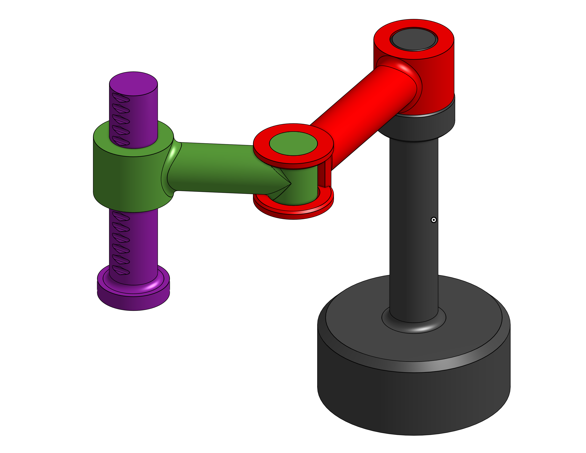

# SimpleRobots

This repository host a ROS2 packages containing a collection of simple kinematic models of well-known robots, keeping them as simple as possible to use them as examples or as material for simple exercises.

## Content of this package

This package contain for now:

<a href="./blob/main/scara/">
    

        
        
SCARA Model

    

</a>

## Depencies

| Name  | Version | Description               |
| :---: | :-----: | :------------------------ |
| ROS2  | Humble  | A running ROS environment |
