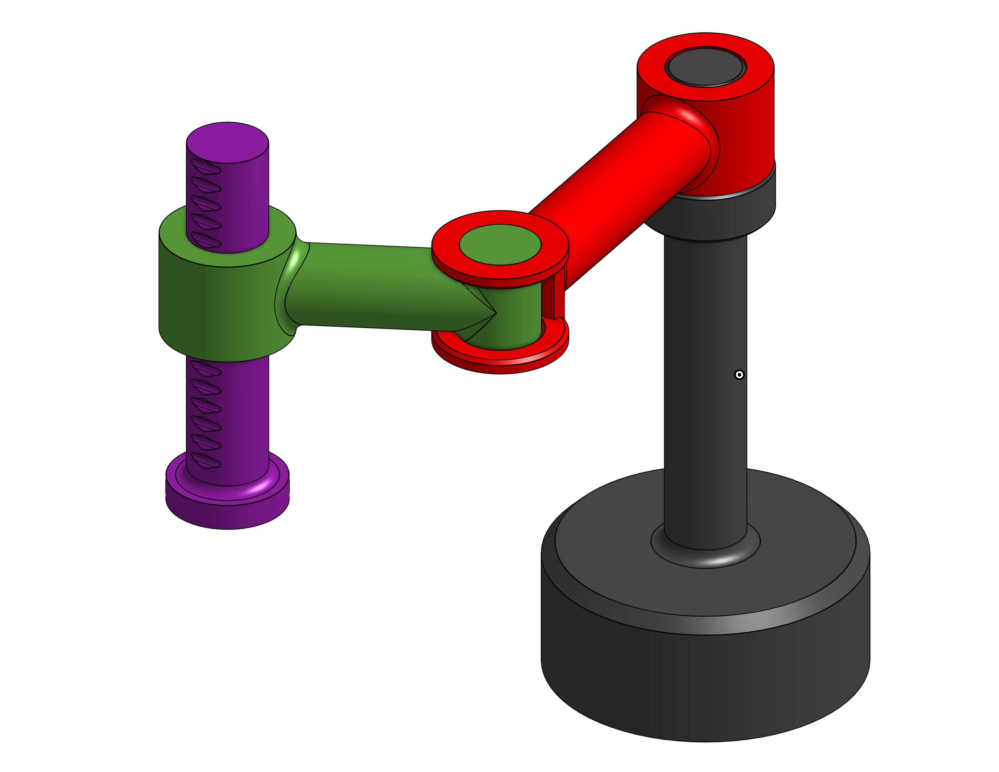

# Kinematic SCARA Model

This folder contains the model for a traditional SCARA-type robot (i.e. 3R1P robot).

    

To see link dimensions and DH parameters, [click here](./SimpleSCARA.pdf). You can also check the [OnShape public project for this robot](https://cad.onshape.com/documents/a8ec36d4dbdf2505f7b0048c/w/44044e1f13f8cd111e2a5f5f/e/34b0f533fc2f9f939c565cd1).

## How to use it

You can load the kinematic SCARA model by using the following command:

`ros2 launch simple_robots scara.launch.py`

It will setup the state publisher, scara simulator and RViz2 viewer.